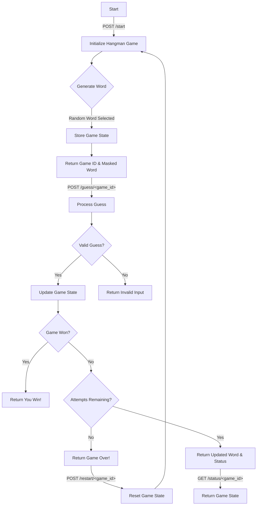

# Hangman AI Tooling Game Challenge
This is a task to build out a HTTP RESTful API for a hangman game using AI tooling. The game should allow players to create and retrieve a game, along with modifying the game's state by making guesses. The development of the API has been started but there are bugs and the logic to make a guess is pending.

The API can be developed with C# (using .NET 8), Java (version 21), Golang(version 1.23.X), Javascript (node version 22) or Python (version 3.14.x). The built out approach should be created on a forked repository, with a pull request created back to this repository.

## Objectives
- Use Copilot effectively for code generation.
- Use prompts to guide Copilot’s suggestions.
- Use Copilot to generate tests and improve code.
- Understand Copilot’s context awareness with multi-file projects.

## Preconditions

The recommended approach for starting this exercise is to:
1. Install git onto your computer. See [here](https://git-scm.com/book/en/v2/Getting-Started-Installing-Git) 
2. (optional) Create a new github account [here](https://github.com/join), you can also use an existing account if you have one. 
3. Fork the repository into your individual Github account.
4. Follow the specific README.md instructions for the chosen platform to run the application (see README.md inside each language folder).
5. Follow instructions [here](#Testing-the-application) to create games, check the game details and make a guess with the requests detailed below.
6. Review the guess logic for your chosen platform and update it so that the requirements are fulfilled.

## Requirements

1. **Initialize Hangman Game**
   - **Endpoint:** `POST /games`
   - **Description:** Initializes a new Hangman game.
   - **Response:**
     - `game_id`: Unique identifier for the game.
     - `masked_word`: The word to guess with letters masked (e.g., "____").

2. **Process Guess**
   - **Endpoint:** `POST /games/<game_id>`
   - **Description:** Processes a guess for a specific game.
   - **Request:**
     - `letter`: The letter being guessed.
   - **Response:**
     - If the guess is valid:
       - `updated_word`: The word with correctly guessed letters revealed.
       - `attempts_remaining`: Number of attempts left.
       - `status`: Current status of the game (e.g., "in_progress", "won", "lost").
     - If the guess is invalid:
       - `error`: Error message indicating invalid input.

3. **Check Game Status**
   - **Endpoint:** `GET /games/<game_id>`
   - **Description:** Retrieves the current state of a specific game.
   - **Response:**
     - `game_id`: Unique identifier for the game.
     - `masked_word`: The word to guess with letters masked.
     - `attempts_remaining`: Number of attempts left.
     - `status`: Current status of the game (e.g., "in_progress", "won", "lost").

4. **Clear Game**
   - **Endpoint:** `DELETE /games/<game_id>`
   - **Description:** Resets the state of a specific game.
   - **Response:**
     - `game_id`: Unique identifier for the game.
     - `masked_word`: The word to guess with letters masked.

### Logic

1. **Generate Word**
   - Randomly select a word from a predefined list of words.
   - Store the selected word and its masked version in the game state.

2. **Valid Guess**
   - Check if the guessed letter is a valid alphabet character.
   - Check if the guessed letter has not been guessed before.

3. **Update Game State**
   - If the guessed letter is in the word, reveal the letter in the masked word.
   - If the guessed letter is not in the word, decrement the number of attempts remaining.
   - Update the game status based on the current state (e.g., "won" if all letters are guessed, "lost" if no attempts remain).

4. **Retrieve Game State**
   - Return the current state of the game, including the masked word, attempts remaining, and game status.

### Flow

