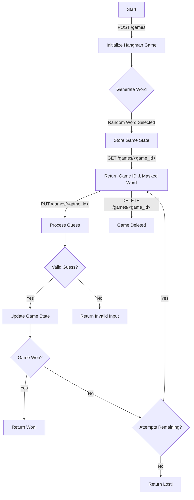

# Hangman AI Tooling Game Challenge
This is a task to build out a HTTP RESTful API for a hangman game using Github Copilot. The game should allow players to create, retrieve and delete a game, along with modifying the game's state by making guesses. The development of the API has been started but there are bugs with logic, missing tests and the logic to make a guess is pending.

This challenge can be developed with C# (using .NET 8), Java (version 21), Golang(version 1.23.X), Javascript (node version 22) or Python (version 3.14.x). 

## Submission Of Challenge
To submit a challenge, a pull request from a forked repository should be created against this repository. It should:
- Implement requirements below.
  - You should try and build this application with best practices in mind; using constants where possible and implementing architectural patterns that make sense.
- Ensure test coverage exists for API request handlers and logic functions.
- Pass all Github Action checks triggered by `pull_request`.

## Learning Objectives
- Use Copilot effectively for code generation.
- Use prompts to guide Copilot’s suggestions.
- Use Copilot to generate tests, and improve code coverage.
- Use Copilot to explain code and offer suggestions.
- Understand Copilot’s context awareness with multi-file projects.

## Before You Start
The recommended approach for starting this exercise is to:
1. (optional) Install git onto your computer. See [here](https://git-scm.com/book/en/v2/Getting-Started-Installing-Git) 
2. (optional) Create a new github account [here](https://github.com/join), you can also use an existing account if you have one. 
3. (optional) Sign up for a Github Copilot account [here](https://github.com/github-copilot/free_signup).
4. (optional) Download and install Visual Studio Code.
    - NOTE: For this exercise we're using visual studio code; however it's also possible to use JetBrains applications or Visual Studio etc.
5. (optional) Install Copilot plugin and set it up in Visual Studio Code:
    - Open Visual Studio Code.
    - Go to the Extensions view by clicking on the Extensions icon in the Activity Bar on the side of the window or by pressing `Ctrl+Shift+X` on windows or `Cmd+Shift+X` on a mac.
    - Search for "GitHub Copilot" and click the Install button.
    - After installation, you may need to sign in to your GitHub account to activate the extension.
    - Follow the prompts to complete the setup process.
6. Fork this repository into your github account.
7. Review [here](#Testing-the-game) for guidance on executing requests against the API.
8. Follow the specific `README.md` instructions for the chosen platform for any additional information.

## Requirements
Below are the high level requirements for the Hangman Game API:

1. **Initialize Game**
   - **Endpoint:** `POST /games`
   - **Description:** Creates a new Hangman game.
   - **Response:**
     - 201 Created:
       - `gameId` - `Guid`: Unique identifier for the game.
       - `maskedWord` - `String`: The word to guess with letters masked (e.g., "____").
       - `attemptsRemaining` - `Integer`: Number of attempts left.
       - example:
       ```
        {
            "gameId": "100011ae-3402-4ccb-ac18-f07713f67970",
            "maskedWord": "______",
            "attemptsRemaining": 5 
        }
       ```

2. **Process Game Letter Guess**
   - **Endpoint:** `PUT /games/<game_id>`
   - **Description:** Processes a guess for a specific game.
   - **Request Body:**
     - `letter` - `String`: The letter being guessed.
     - example:
     ```
      {
            "letter": "a"
      }
     ```
   - **Response:**
     - 200 OK:
       - `maskedWord` - `String`: The word with correctly guessed letters revealed.
       - `attemptsRemaining` - `Integer`: Number of attempts left.
       - `guesses` `String[]` - : The letters that have been guessed so far.
       - `status` - `String`: Current status of the game (e.g., "In Progress", "Won", "Lost").
       - example:
       ```
        {
            "maskedWord": "_a_a_a",
            "attemptsRemaining": 3,
            "guesses": ["e", "f", "a"]
            "status": "In Progress"
        }
       ```
     - 400 Bad Request:
       - `error`: Error message indicating invalid input.
       - example:
       ```
        {
            "message": "Cannot process guess",
            "errors": [{
                "field": "letter",
                "message": "Letter cannot accept more than 1 character"
            }]
        }
       ```

3. **Check Game Status**
   - **Endpoint:** `GET /games/<game_id>`
   - **Description:** Retrieves the current state of a specific game.
   - **Response:**
     - 200 OK:
       - `maskedWord` - `String`: The word with correctly guessed letters revealed.
       - `attemptsRemaining` - `Integer`: Number of attempts left.
       - `guesses` `String[]` - : The letters that have been guessed so far.
       - `status` - `String`: Current status of the game (e.g., "In Progress", "Won", "Lost").
       - example:
       ```
        {
            "maskedWord": "_a_a_a",
            "attemptsRemaining": 3,
            "guesses": ["e", "f", "a"]
            "status": "In Progress"
        }
       ```
    - 404 Not Found

4. **Clear Game**
   - **Endpoint:** `DELETE /games/<game_id>`
   - **Description:** Removes a specific game.
   - **Response:**
     - 204 No Content
     - 404 Not Found

### Game Flow
This represents an example flow for a game in terms of APIs called and expected behaviour: 



### Logic Requirements

1. **Generate Word**
   - Randomly select a word from a predefined list of words.
   - Store the selected word and its masked version in the game state.

2. **Valid Guess**
   - Check if the guessed letter is a valid alphabet character.
   - Check if the guessed letter has not been guessed before.
   - Handle both upper and lower case characters

3. **Update Game State**
   - If the guessed letter is in the word, reveal the letter in the masked word.
   - If the guessed letter is not in the word, decrement the number of attempts remaining.
   - Update the game status based on the current state (e.g., "won" if all letters are guessed, "lost" if no attempts remain).

4. **Retrieve Game State**
   - Return the current state of the game, including the masked word, attempts remaining, and game status.

## Testing the Game

Platform specific runtimes and README guides can be found within the repository platform folders; however once the application is running the API usage is the same across the languages. All of the hangman APIs run on port 4567 and can be accessed from http://localhost:4567

For this exercise we recommend using [Postman](https://www.postman.com/downloads/?utm_source=postman-home) for making the requests above. 

NOTE: If interested additional tutorials for postman general usage and additionally around using `Postbot` to build API Tests, guidance can be found [here](https://learning.postman.com/)

## Suggestions
In additional to the requirements, in order to demonstrate additional value with Copilot, there are some additional suggestions to try below:
- Retrieve words from an external API, for example: https://random-word-api.herokuapp.com/word?lang=en 
  - We can also specify different languages (`lang=en|es|it|de|fe|zh|pt-be`) to extend the approach. This would involve updating the create game request body.
- Build out a robust, reusable validation approach.
- Use constants for game state.
- Implement an architectural pattern; for example Layered architecture for business logic, retrievals from memory and external sources.
- Implement mocking with a library for unit tests.

## Further Reading
In additional to this exercise, there are some great resouces for additional content:
- [Copilot VsCode Cheat Sheet](https://code.visualstudio.com/docs/copilot/copilot-vscode-features)
- [Github Copilot Best Practices](https://docs.github.com/en/copilot/using-github-copilot/best-practices-for-using-github-copilot)
- [Prompt Engineering Github Guide](https://docs.github.com/en/copilot/using-github-copilot/prompt-engineering-for-github-copilot)
- [Microsoft Learning Path](https://learn.microsoft.com/en-us/training/paths/copilot/)
- [Open AI Prompt Engineering Best Practices](https://platform.openai.com/docs/guides/prompt-engineering)

It is also recommded to get comfortable with the commands like `/fix`, `/explain`, `@workspace` etc.

## Final Notes

Github Copilot is *NOT* a silver bullet for all scenarios and certainly doesn't replace the critical thinking and context that a developer will possess. There are areas where it excels, particularly with boilerplate and pure functions; but additionally it can easily generate some hullicinations if prompts aren't clear or there is a lot of context to a problem.

The take away should be that copilot is a tool that massively help with code completion, translations, ideation, boilerplate etc; but you can very easily end up taking more time on a fairly straightforward problem and everything it generates still needs reviewed and adapted. It should be treated as a copilot, not an autopilot.